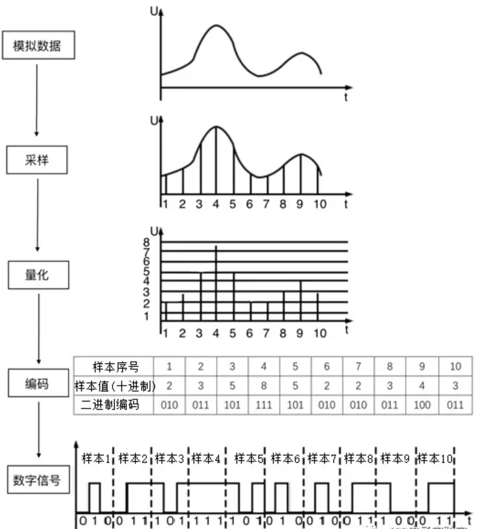
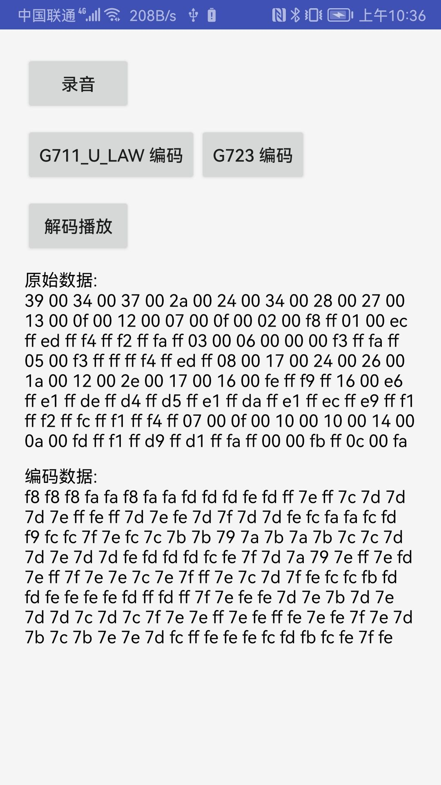

# AndroidAudioCodec

## 介绍
Android使用C++实现音频编解码算法(G711_A_LAW、G711_U_LAW、G723)。

## 使用 C++ 实现音频编解码算法
1. 音频编解码器包括
   G711_A_LAW、G711_U_LAW、G723
2. 实现原理见博客
   https://yadiq.github.io/2022/08/03/AudioCodec/
   

## 效果图
